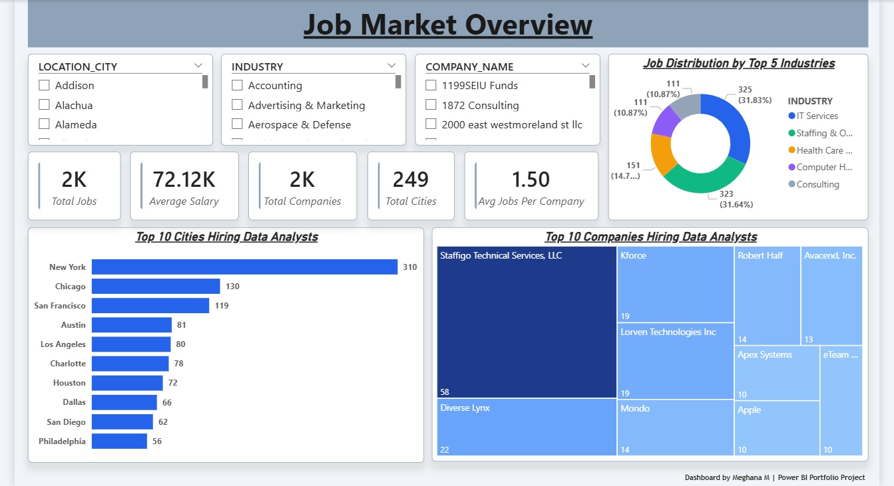
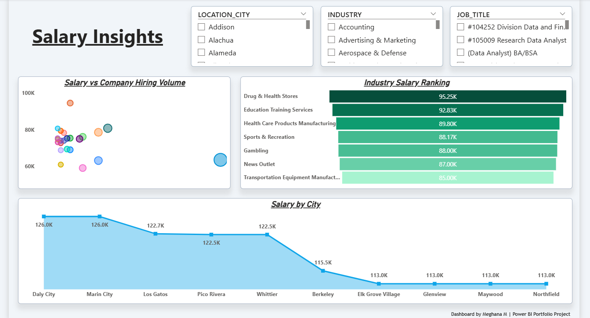
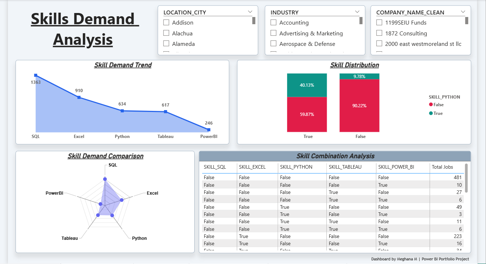
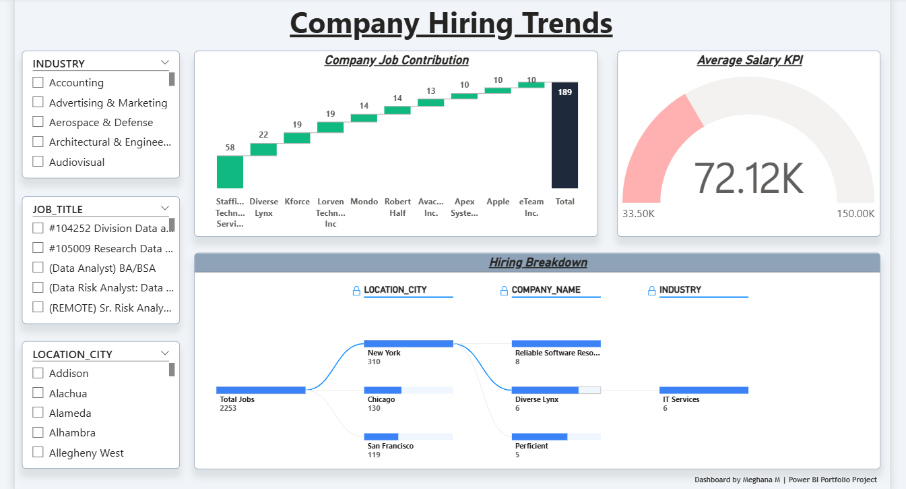
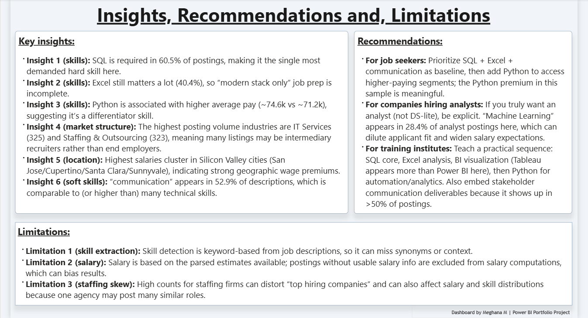

# 📊 Data Analyst Job Market Intelligence Dashboard

> Transforming raw job posting data into actionable insights about hiring trends, skill demand, and salary patterns in the Data Analyst job market.

---
## 🔗 Live Dashboard

**Power BI Service Link**: https://app.powerbi.com/links/6hUCwRQxGb?ctid=442e6744-dea2-475b-a7fd-27cb5af249db&pbi_source=linkShare

---

## 📌 Project Overview

The **Data Analyst Job Market Intelligence Dashboard** is an end-to-end analytics project that explores hiring trends for Data Analyst roles across industries, companies, and locations.

The project analyzes a dataset of job postings to understand:

- Which **technical skills are most demanded** by employers
- Which **industries hire the most Data Analysts**
- Which **cities offer the highest salary opportunities**
- Which **companies actively recruit analysts**
- Which **skill combinations frequently appear in job postings**

The solution uses **SQL-based analysis, data modeling, and interactive visualization** to convert raw job listing data into a structured intelligence dashboard.

The final output is a **multi-page interactive Power BI dashboard** that enables users to explore job market patterns, skill demand, and hiring behavior.

---

## 🎯 Business Problem Statement

The demand for Data Analysts is rapidly growing, but job seekers and training institutions often struggle to understand the real requirements of the job market.

Key questions remain unanswered:

- What **technical skills should aspiring analysts prioritize?**
- Which **industries provide the most job opportunities?**
- Which **companies consistently hire Data Analysts?**
- How do **salary patterns vary across locations and industries?**
- What **skill combinations are most valuable in the job market?**

Without structured analysis, career planning becomes difficult.

This project addresses the problem by building a **Job Market Intelligence Dashboard** that converts job posting data into meaningful insights using modern data analytics tools.

---

## 🛠 Tools & Technologies Used

- **Snowflake** – Cloud Data Warehouse for SQL analysis  
- **Julius AI** – AI-assisted data exploration and feature understanding  
- **Power BI** – Interactive dashboard and data visualization  
- **DAX (Data Analysis Expressions)** – KPI calculations and analytical measures  
- **Data Visualization Techniques** – Business intelligence reporting

---

## 🗂 Repository Structure

```

📁 Dataset
└── DataAnalyst_features.csv

📁 Project Report
└── Data Analyst Job Market Intelligence Dashboard Report.pdf

📁 Screenshots
├── 1_Job_Market_Overview
├── 2_Salary_Insights
├── 3_Skills_Demand_Analysis
├── 4_Company_Hiring_Trends
└── 5_Insights_Recommendations_Limitations

📁 Snowflake SQL
└── JobMarketData.sql

📄 Data Analyst Job Market Intelligence Dashboard.pbix

📄 Data Analyst Job Market Intelligence Dashboard.pptx

📄 README.md

```


---

# 📊 Dashboard Structure

The dashboard is organized into **four analytical pages** and a final insights page.

---

# 🔹 Page 1 – Job Market Overview

Provides a high-level summary of the Data Analyst job market.

### Key KPI Cards
- Total Job Postings
- Average Salary
- Total Companies Hiring
- Total Cities with Job Opportunities
- Average Jobs per Company

### Visualizations
- **Clustered Bar Chart** – Top Cities Hiring Data Analysts
- **Donut Chart** – Job Distribution by Industry
- **Treemap** – Top Companies Hiring Analysts

This page helps identify **where demand is concentrated geographically and across industries**.



---

# 🔹 Page 2 – Salary Insights

Analyzes salary distribution across industries and locations.

### Key Visualizations
- **Scatter Plot** – Salary vs Company Hiring Volume
- **Bar Chart** – Average Salary by Industry
- **Area Chart** – Salary Patterns Across Cities

This page highlights **high-paying industries and geographic salary clusters**.



---

# 🔹 Page 3 – Skills Demand Analysis

Examines the most demanded technical skills for Data Analyst roles.

### Visualizations
- **Radar Chart** – Skill Demand Comparison
- **100% Stacked Column Chart** – Skill Distribution
- **Area Chart** – Skill Demand Trend
- **Matrix Visualization** – Skill Combination Analysis

The matrix visualization helps identify **which skills frequently appear together in job postings**.



---

# 🔹 Page 4 – Company Hiring Trends

Analyzes hiring behavior across companies and industries.

### Visualization
- **Ribbon Chart** – Top Hiring Companies by Industry

This page helps identify **which organizations actively recruit Data Analysts**.



---

# 🔹 Page 5 – Insights, Recommendations & Limitations

This section summarizes analytical findings and provides actionable guidance.



---

# 📈 Key Insights

- **SQL is the most demanded skill** across Data Analyst job postings.
- **Excel remains highly relevant** for business data analysis tasks.
- **Python is associated with higher average salaries** compared to other technical skills.
- **Technology and staffing companies dominate hiring activity**.
- Job opportunities are **highly concentrated in major metropolitan cities**.
- Employers often require **multiple complementary skills rather than a single tool**.

---

# 🚀 Recommendations

### For Job Seekers
- Focus on building a **strong foundation in SQL and Excel**.
- Learn **Python and visualization tools** to increase job competitiveness.
- Build **real-world projects and dashboards** to showcase analytical ability.

### For Training Institutions
- Design curriculum covering **SQL → Excel → Data Visualization → Python**.
- Include practical case studies and dashboard projects.

### For Organizations
- Clearly define skill requirements in job descriptions.
- Align job roles with actual analytical responsibilities.

---

# 🧠 Data Analysis Workflow

The project followed a structured analytics workflow:

1. **Data Exploration**
   - Initial dataset exploration using SQL queries in Snowflake.

2. **Data Preparation**
   - Cleaning and structuring job posting data.

3. **Feature Analysis**
   - Identifying skill demand and salary patterns.

4. **Dashboard Development**
   - Building interactive visuals in Power BI.

5. **Insight Generation**
   - Interpreting results to derive actionable recommendations.

---

# 📦 Project Deliverables

- Cleaned Job Market Dataset  
- SQL Analysis Queries  
- Interactive Power BI Dashboard  
- Project Report Documentation  
- Presentation Deck  
- Power BI PBIX File  

---

# 📌 Limitations

- The dataset represents only a **sample of job postings** and may not cover the entire job market.
- Some job listings **do not include salary information**, limiting salary analysis.
- Skill extraction is based on **predefined skill indicators**, so additional skills in job descriptions may not be captured.

---

# 🏁 Conclusion

The **Data Analyst Job Market Intelligence Dashboard** demonstrates how modern analytics tools can transform raw job market data into meaningful insights.

By combining **SQL analysis, data modeling, and interactive visualization**, the project provides a clear view of:

- Hiring demand
- Skill requirements
- Salary patterns
- Company recruitment trends

The dashboard can support **career planning, skill development strategies, and workforce analysis** for aspiring data analysts and organizations alike.

---

# 👩‍💻 Author

**Meghana M**  
Aspiring Data Analyst | Business Intelligence Enthusiast  

LinkedIn:  
https://www.linkedin.com/in/meghana-m17official/

GitHub:  
https://github.com/meghana-officialhub/

---

⭐ If you found this project useful, feel free to explore the dashboard, report, and dataset to gain deeper insights into the Data Analyst job market.
```
